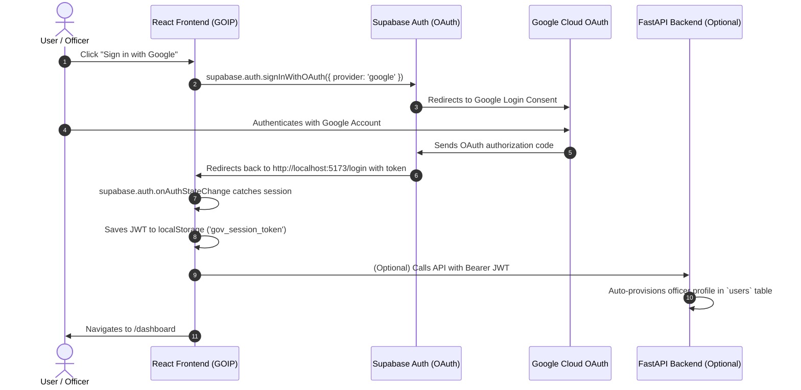

# Google Authentication with Supabase — Step-by-Step Setup Guide

This guide walks you through connecting your **Google Cloud OAuth 2.0 Credentials** with **Supabase Authentication** and testing the login flow in this application.

---

## Architecture Overview



---

## 1. Google Cloud Console Setup

### Step 1.1: Create or Select a Project
1. Go to the [Google Cloud Console](https://console.cloud.google.com/).
2. In the top navigation bar, click the project dropdown and click **"New Project"**.
3. Name your project (e.g. `GOIP File Tracking System`) and click **Create**.

### Step 1.2: Configure OAuth Consent Screen
1. In the left sidebar, navigate to **APIs & Services** → **OAuth consent screen**.
2. Select User Type:
   - **External** (for testing with any `@gmail.com` account) or **Internal** (if using Google Workspace).
3. Click **Create**.
4. Fill in:
   - **App name**: `GOIP File Tracking System`
   - **User support email**: Your email address
   - **Developer contact email**: Your email address
5. Click **Save and Continue** through the *Scopes* and *Test users* screens (add your test Gmail under *Test users* if in External mode).

### Step 1.3: Create OAuth 2.0 Credentials
1. In the left sidebar, navigate to **APIs & Services** → **Credentials**.
2. Click **+ CREATE CREDENTIALS** → **OAuth client ID**.
3. Set **Application type**: `Web application`.
4. Set **Name**: `Supabase GOIP Auth Client`.
5. Under **Authorized JavaScript origins**, add:
   - `http://localhost:5173`
   - `https://<YOUR-SUPABASE-PROJECT-REF>.supabase.co`
6. Under **Authorized redirect URIs**, add your Supabase Auth callback URL:
   - `https://<YOUR-SUPABASE-PROJECT-REF>.supabase.co/auth/v1/callback`
   *(Replace `<YOUR-SUPABASE-PROJECT-REF>` with your Supabase reference, e.g. `https://your-project-ref.supabase.co/auth/v1/callback`)*
7. Click **Create**.
8. Copy your **Client ID** and **Client Secret**.

---

## 2. Supabase Dashboard Setup

### Step 2.1: Enable Google Auth Provider
1. Go to your [Supabase Dashboard](https://supabase.com/dashboard).
2. Select your project.
3. In the left sidebar, click **Authentication** → **Providers**.
4. Find **Google** in the list and click to expand it.
5. Toggle **Enable Google provider** to ON.
6. Paste your **Client ID** and **Client Secret** obtained in Step 1.3.
7. Click **Save**.

### Step 2.2: Configure Redirect URLs
1. In the left sidebar, go to **Authentication** → **URL Configuration**.
2. Set **Site URL**:
   ```
   http://localhost:5173
   ```
3. Under **Redirect URLs**, click **Add URL** and add:
   ```
   http://localhost:5173/login
   http://localhost:5173/**
   ```
4. Click **Save**.

---

## 3. Database Sync Trigger (Optional but Recommended)

To automatically insert a row into your `public.users` table whenever an officer signs in via Google OAuth, run this in your **Supabase SQL Editor**:

```sql
CREATE OR REPLACE FUNCTION public.handle_new_user()
RETURNS trigger AS $$
BEGIN
  INSERT INTO public.users (id, email, name, role, department, designation, badge_number)
  VALUES (
    new.id,
    new.email,
    COALESCE(
      new.raw_user_meta_data->>'full_name',
      new.raw_user_meta_data->>'name',
      split_part(new.email, '@', 1)
    ),
    'OPERATIONS_OFFICER',
    'General Administration',
    'Operations Officer',
    'GOI-' || UPPER(SUBSTRING(new.id::text, 1, 8))
  )
  ON CONFLICT (id) DO UPDATE SET
    email = EXCLUDED.email,
    name = COALESCE(EXCLUDED.name, public.users.name);
  RETURN new;
END;
$$ LANGUAGE plpgsql SECURITY DEFINER;

DROP TRIGGER IF EXISTS on_auth_user_created ON auth.users;
CREATE TRIGGER on_auth_user_created
  AFTER INSERT ON auth.users
  FOR EACH ROW EXECUTE FUNCTION public.handle_new_user();
```

---

## 4. Local Environment Verification

Ensure your `.env` file in the root directory contains:

```env
VITE_USE_MOCK_API=false
VITE_API_BASE_URL=http://localhost:8000
VITE_SUPABASE_URL=https://<your-project>.supabase.co
VITE_SUPABASE_ANON_KEY=<your-anon-key>
```

### Running the App:
```bash
npm run dev
```

1. Open `http://localhost:5173/login` in your browser.
2. Click **"Sign in with Google (Supabase Auth)"**.
3. Select your Google account.
4. You will be redirected back and signed in automatically to the `/dashboard`.
